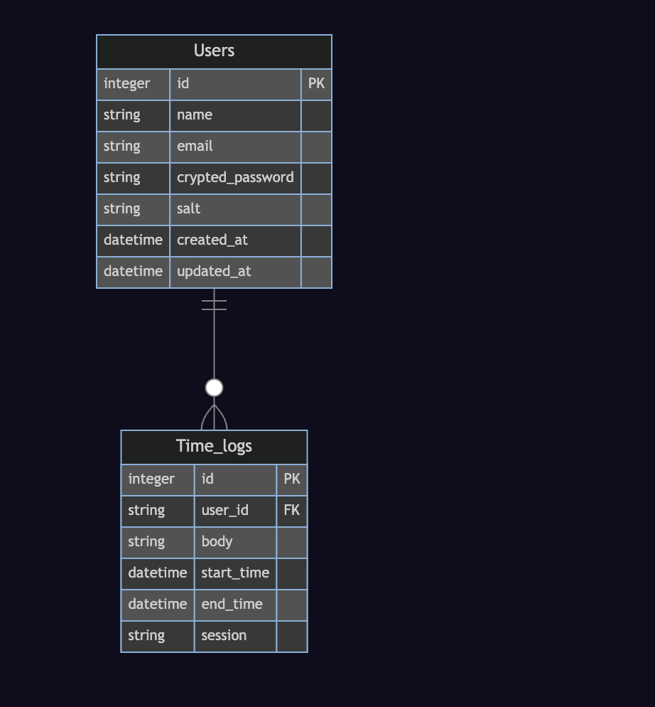

# Time_schedule_app

# 使用言語

- Backend 　:　 Ruby on Rails
- Frontend 　:　 React, TypeScript
- DB 　:　 MySQL
- Docker,Docker-compose
- インフラ　:　 AWS,GCP,Heroku とか？
- UI コンポーネント　：　 Tailwind

# 画面遷移図


# ER 図



# 開発手順

1〜5 を繰り返してく

## 1.　 GitHub で issue を作成する、割り振る

## 2.　開発用のブランチをきって、実装していく

作業するディレクトリへ移動して

```
git checkout -b 作業ブランチ名
```


vscode の左下の'main'がコマンドで打った作業ブランチ名になっていれば OK  
そのまま実装を開始する

## 3.　プルリクエストを作成

実装が終わったら、リモートリポジトリに実装内容を push する

```
git add .
```

```
git commit -m 'commitメッセージ'
```

```
git push
fatal: The current branch fix_read.me has no upstream branch.
To push the current branch and set the remote as upstream, use

    git push --set-upstream origin fix_read.me  <--これを実行
```

```
git push --set-upstream origin fix_read.me <--2回目からはgit pushだけでOK
```

※上記でうまくいかない時
```
git pull --rebase origin main
```

```
git push --set-upstream origin main
```

Github の web ページでプルリクエストを作成する

`Compare & Pull Reqest`をクリック


実装内容や issue の URL を書いて、`Create Pull Request`をクリック


プルリクエストの作成は完了  
プルリクエストの URL を共有してレビューしてもらう


## 4.　レビューする

[レビュー方法](https://howpon.com/6351)  
[ローカルでプルリクエストの内容を確認する方法](https://qiita.com/great084/items/ad74dd064a2c2bc47cff)

## 5.　プルリクエストをマージ、issue はクローズ、ブランチは削除

レビューが OK になったら、`Merge Ppull request`をクリック


レビューが OK になったら、`Confirm merge`をクリック


`Delete branch`をクリックして、作業用ブランチを削除する


# Gem の候補

1. Devise: Devise は Ruby on Rails 向けの認証用 Gem です。簡単にユーザー認証システムを作成することができます。
2. Omniauth: Omniauth は外部サービス（Facebook、Twitter、Google など）からの認証を行うための Gem です。Devise と組み合わせて使用することができます。
3. Time_trackable: Time_trackable は時間の記録と管理を行うための Gem です。打刻時間管理の機能を実装することができます。
4. clockable: clockable は打刻時間管理を行うための Gem です。シンプルで使いやすいインターフェイスを提供します。

# Github Action に設定する？

Linting
Continuous Integration (CI)

# Docker コマンド

各コンテナの立ち上げ

```
docker-compose up -d
```

コンテナ停止

```
docker-compose stop
```

コンテナ一覧の確認

```
docker container ls -a
```
